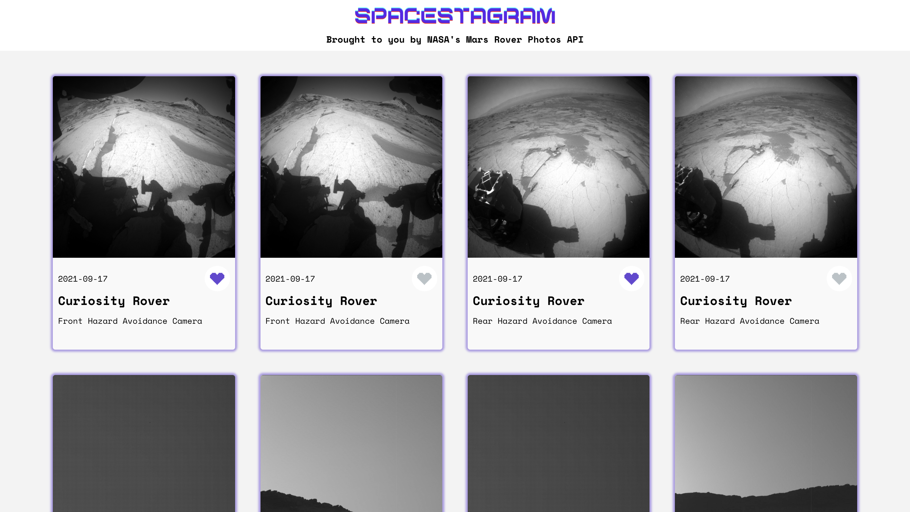
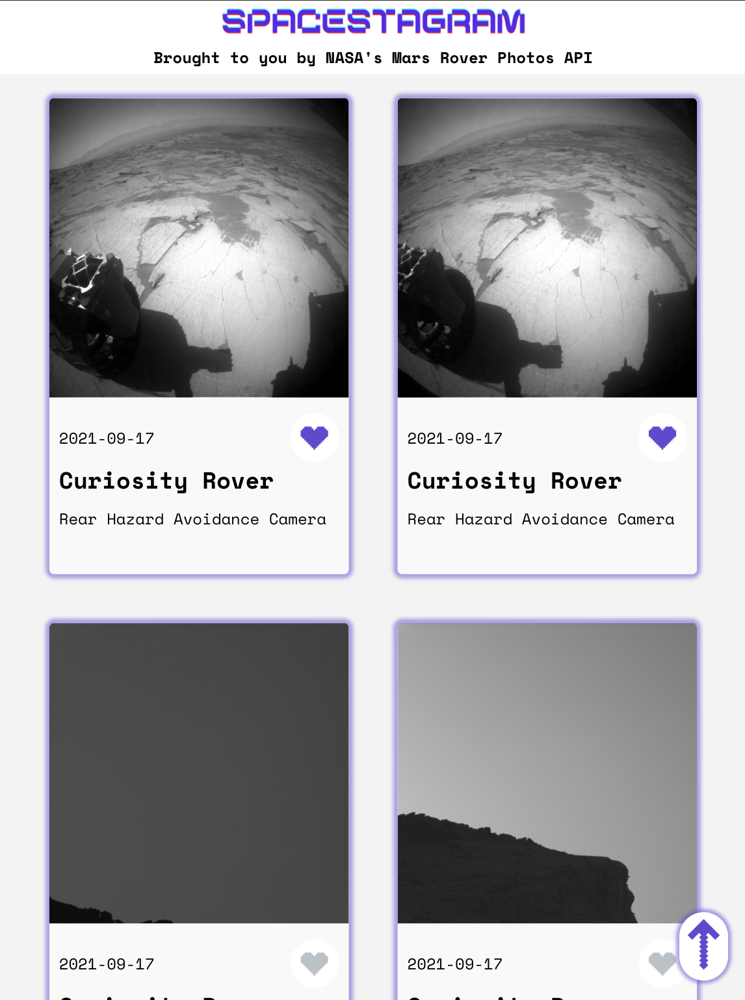
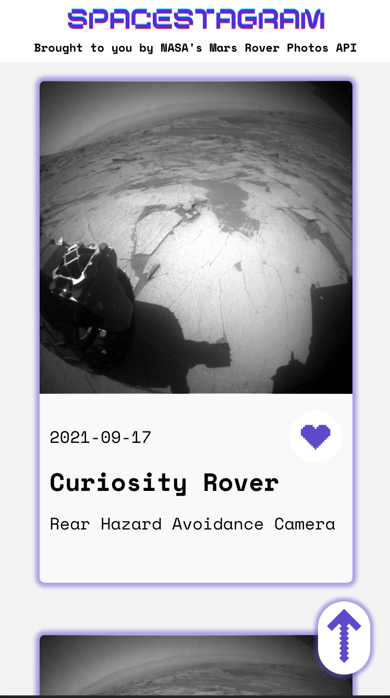

## Spacestagram

#### Spacestagram: Image-sharing from the final frontier!

A responsive web application used to pull images form NASA's Mars Rover Photos API. Built with React, JavaScript, and SCSS.

Visit the deployed app here: [ahayes-spacestagram.netlify.app](https://ahayes-spacestagram.netlify.app)

## Project Screen Shots

#### Desktop:

#### Tablet:

#### Mobile:

## Reflection

This project was built by me in 1 week as a technical challenge for the Shopify Frontend Developer Internship. Project goals included using technologies learned up until this point and familiarizing myself with ways to implement new features.

I met the technical requirements for this project as follows:

  - Image results come from NASA's free Mars Rover Photos API.
  - Each image includes the rover name, date of capture, camera used to capture the image, and a button that allows the user to 'like' and 'unlike'.
  - The application is accessible and the HTML that is served client-side is semantic.

I chose to add the following extra features to improve the application:

  - Used JavaScript and CSS to animate the heart-shaped like button when the user clicks it.
  - Added a loading state that features an animated planet Mars while waiting for NASA's API to return data.
  - Implemented a button that utilizes a JavaScript function to appear when the user has scrolled down, and allows them to click to return to the top of the page.

I wanted to build a responsive web application using a mobile first approach that allowed users to pull data from NASA's API for Mars Rover Photos. I started this process by using the `create-react-app` boilerplate, then adding `axios` and `sass`.

One of the main challenges I ran into was when I originally chose to use NASA's Astronomy Photo of the Day API. I found that not all images or videos would be rendered, and because the photo descriptions were of varying lengths, it was difficult to style the app in a symmetrical and visually pleasing way. Given the the time constraints, I decided to switch to the Mars Rover Photo API because the descriptive data was more simple to fit under each image.

At the end of the day, the technologies implemented in this project are React, Axios, JavaScript, JSX, Flexbox and SCSS. I chose to use the `create-react-app` boilerplate to minimize initial setup and invest more time into styling this as a responsive app.

## Installation and Setup Instructions

Clone down this repository. You will need `node` and `npm` installed globally on your machine.  

Installation:

`npm install`  

To Start Server:

`npm start`  

To Visit App:

`http://localhost:3000/`
